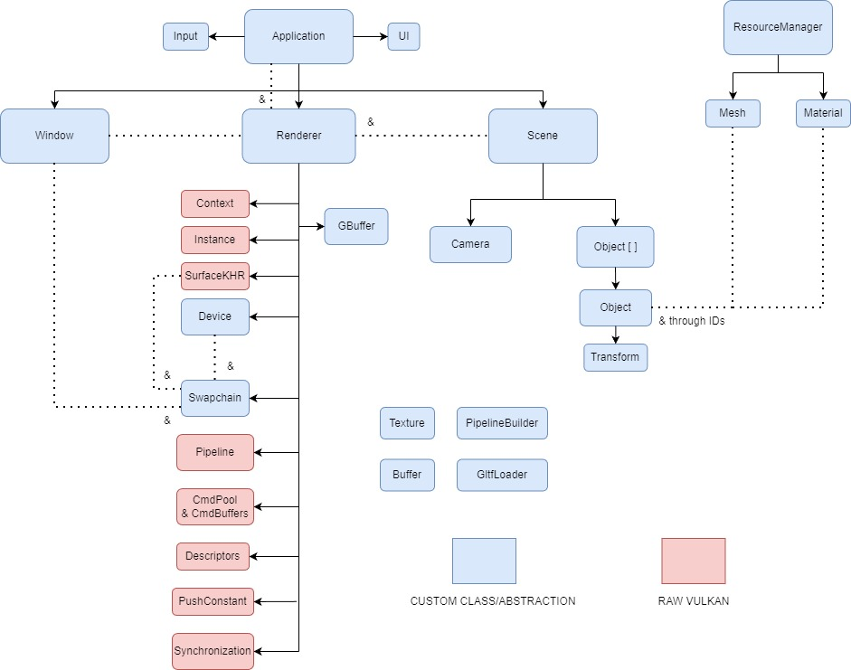

# Felina


Felina is a 3D renderer, i.e. a piece of software which takes a scene description as input and produces pretty visuals as output. 
It is written in C++20 and uses Vulkan 1.4 under the hood.

This project started as a way of learning the Vulkan API and getting some hands-on experience on C++, 
then it became more of a tool to study and experiment with real-time rendering techniques that pique my interests. 
Sometimes some quality of life features outside of real-time rendering are added to improve the user experience, 
e.g. basic user interface, abstractions, etc.

Currently I'm working on adding texture supports on my materials.

# Features
- simple user interface
- full deferred rendering pipeline
- material system using Blinn-Phong lighting model
- texture support
- glTF scene loading
# Roadmap
## Short term
- multiple lights
- PBR materials
- improve UX
## Long term
- cascaded shadow maps
- hybrid GI

# Getting Started
## Prerequisites
- CMake 4.0 or higher
- C++20
- Vulkan 1.4+ SDK
## Dependencies
- [GLFW 3.4](https://www.glfw.org/)
- [GLM 1.0.1](https://github.com/g-truc/glm)
- [Vulkan Memory Allocator 3.3.0](https://github.com/GPUOpen-LibrariesAndSDKs/VulkanMemoryAllocator)
- [Dear ImGui 1.92.4 (docking)](https://github.com/ocornut/imgui)
- [tinygltf 2.9.7](https://github.com/syoyo/tinygltf)
## Build instructions
### Windows
1. Clone this repository:
```bash
git clone https://github.com/Frol3z/Felina.git
cd Felina
```
2. Create and enter the build directory:
```bash
mkdir build
cd build
```
3. Generate project files using CMake:
```bash
cmake ..
```
4. Open the generated **solution** inside the build folder.
5. Set `Felina` as the **startup project** in Visual Studio.
6. Build and run the project.

# Architecture


## GBuffer structure
| Attachment # | R              | G              | B               | A      |
| ------------ | -------------- | -------------- | --------------- | ------ |
| 0            | BaseColor.R    | BaseColor.G    | BaseColor.B     | Unused |
| 2            | Roughness      | Metalness      | Ambient Coeff.  | Unused |
| 3            | Normal.X       | Normal.Y       | Normal.Z        | Unused |
| 4            | Depth          | Depth          | Depth           | Depth  |

## Descriptors
### Geometry Pass
| Descriptor Set Layout | Binding | Set | VS  | FS  |
| :-------------------- | :-----: | :-: | :-: | :-: |
| Camera                |    0    |  0  |  Y  |  N  |
| Objects               |    0    |  1  |  Y  |  N  |
| Materials             |    0    |  2  |  N  |  Y  |
| Samplers              |    0    |  3  |  N  |  Y  | *
| Textures              |    1    |  3  |  N  |  Y  | *
| Skybox                |    2    |  3  |  N  |  Y  | *

| Push Constants | VS  | FS  |
| -------------- | --- | --- |
| Objects        | Y   | N   |

### Lighting Pass
| Descriptor Set Layout |        Binding         | Set | VS  | FS  |
| :-------------------- | :--------------------: | :-: | :-: | :-: |
| Camera                |           0            |  0  |  N  |  Y  |
| GBuffer               | See attachment # above |  1  |  N  |  Y  |

# References

## General
https://docs.vulkan.org/tutorial/latest/00_Introduction.html
https://registry.khronos.org/vulkan/specs/latest/html/vkspec.html
https://www.learncpp.com/
https://www.realtimerendering.com/
https://docs.vulkan.org/guide/latest/hlsl.html

## On specific topics
https://developer.nvidia.com/vulkan-memory-management
https://wallisc.github.io/rendering/2021/04/18/Fullscreen-Pass.html
